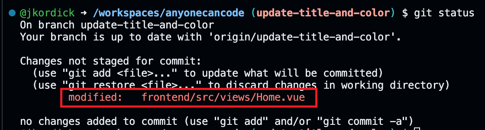

# 課題2：コードの変更とプルリクエストの作成とマージ


⏲️ _完了までの時間: 60 min._ ⏲️

## このパートで学ぶこと 🎯

- プロジェクトに新しいブランチを作成します
- タイトルを変更するためにコードを変更しよう
- Codespaceで変更を確認します
- 変更をコミットしてプッシュします
- プルリクエストを開き、マージします

## 目次

- [課題2：コードの変更とプルリクエストの作成とマージ](#課題2コードの変更とプルリクエストの作成とマージ)
  - [このパートで学ぶこと 🎯](#このパートで学ぶこと-)
  - [目次](#目次)
  - [プロジェクトに新しいブランチを作成します](#プロジェクトに新しいブランチを作成します)
  - [アプリのタイトルと色を変更する](#アプリのタイトルと色を変更する)
  - [CodeSpace で変更した内容を確認します](#codespace-で変更した内容を確認します)
  - [変更をコミットしてプッシュします](#変更をコミットしてプッシュします)
  - [プルリクエストを作成し、マージします](#プルリクエストを作成しマージします)


## プロジェクトに新しいブランチを作成します

GitHubのリポジトリに移動します。"main" をクリックして、新しいブランチの名前 **「update-title-and-color」** を入力します。次に **[Branch：Update-Title-and-Color]** をクリックしてブランチを作成します。


ターミナルにいくつかのGitコマンドを入力して、新しいブランチを作成しましょう。


<details>
<summary>ターミナルとはなんですか？</summary>

私たちはマウスを動かしてコンピューターを操作することに慣れています。

しかし、コンピューターを操作できる別の方法があります。それがターミナルです。マウスを使うする代わりに、ターミナルにコマンドを入力するとコンピューターを操作できます。

たとえば、コンピューターの特定のフォルダーに移動したい場合があります。そのときは、ターミナルに `cd <path-to-your-folder>` を入力します。

ほかにも数多くのコマンドがあります。すべてのコマンドのセットとその組み合わせをシェルスクリプト言語と呼びます。ターミナルで（写真に表示されているよう小さなボックス）に移動して`help` と入力すると、すべての組み込みコマンドが一覧表示されます。

自由にコマンドを試してみてください。よく使う一般的なコマンドは、`pwd` （現在のディレクトリのパスを出力する、pwdは印刷作業ディレクトリの略）や `ls`（現在のリポジトリ内のすべてのファイルをリスト）などがあります。

</details>

Codespaceに戻り、ターミナルに次のコマンドを入力します。

```bash
git pull
```

次に、ブランチを切り替えます。

```bash
git checkout update-title-and-color
```


おめでとうございます！新しいブランチを作成し、正常に切り替えができました。これで、コードの修正を始められます！


## アプリのタイトルと色を変更する

フォルダー `frontend/src/views` にあるファイル `Home.vue` を開きます。このファイルにはホームビューの基本構造をきめる `<template>` があります。今はアプリ名が「Milligram」になっています。これをあなたが好きなタイトルを変更するには、 `<b-navbar-item>` タグ間のテキストを変更します。


色を変更するには、 `<b-navbar-item>` タグに新しい属性を追加する必要があります。属性は `style` と呼ばれ、タイトルを緑にするために `color: green` に設定できます。他の色を試したいときは[ここ](https://htmlcolorcodes.com/color-names/) から選んでください。

```html
    <b-navbar fixed-top :mobile-burger="false">
      <template #brand>
        <div id="left"></div>
        <div id="right"></div>
        <div id="top"></div>
        <div id="bottom"></div>
        <b-navbar-item id="fontnavbar" class="title is-2" style="color: green">
          Milligram <= ここに好きなアプリ名前を入れてください
        </b-navbar-item>
      </template>
    </b-navbar>
```


## CodeSpace で変更した内容を確認します

1. プロンプトが表示されたら、推奨されている拡張機能をインストールします。
2. ターミナルで、`cd frontend` を入力し、フロントエンドフォルダーに移動します
3. `npm install` を入力して、必要なパッケージをインストールします。
4. Build the app with this command - `npm run dev`
4. `npm run dev` を入力してこのコマンドを使用してアプリを実行します。
5. ポップアップが表示されたら、[閲覧] をクリックしてください。ブラウザが開き変更が表示されるはずです
6. 次に、タイトルの色を別の色に変更してみてください。ページを更新することなく、色はブラウザで自動的に変更されます！

```bash
cd frontend
npm install
npm run dev
```


| :warning: トラブルシューティング         |
|:---------------------------|
| 「open in browser」ポップアップがウィンドウの下部に表示されない場合は、ページを更新して再試行してください  |

## 変更をコミットしてプッシュします

ターミナルの右側にある `+` ボタンをクリックして、新しいターミナルを作成します。アプリの実行を停止したくないため、次のステップは新しいターミナルを使用します。


変更を確認した後、コミットしてプッシュする時が来ました。最初は、どのファイルを変更したかを確認したいと考えています。ターミナルに `git status` と入力し、**[Enter]** を押します。**home.vue** ファイルに変更があるため、変更されたとマークされていることがわかります。




最初に `git add` コマンドを実行します。これにより、すべての変更されたファイルがステージング領域に追加されます。その後、`git commit -m "Update title and color"` を実行します。`-m` フラグは、コミットメッセージを追加するために使用されます。意味のあるコミットメッセージを追加して、他の人があなたが変えたものを理解できるようにすることが重要です。その後、`git push` を実行して、GitHubに変更をプッシュします。

```bash
git add .
git commit -m "Update title and color"
git push
```


## プルリクエストを作成し、マージします


次に、ブラウザでGitHubリポジトリに戻ります。**Compare & pull request** ボタンをクリックして、新しいプルリクエストを作成します。

> このメッセージが表示されない場合は、**Pull requests** タブをクリックし、**New pull request** ボタンをクリックします。


新しいウィンドウが開きます。ここでは、最後のコミットメッセージをタイトルとして見ることができ、必要があれば説明を追加することもできます。次にマージをします。ここでは必ず、**ご自身でフォークした独自のリポジトリのメインブランチを選択** していることを確認してください。

左下の**Create pull request**  ボタンをクリックして、新しいプルリクエストを作成します。

> **重要！注意！！**
> 以下のスクリーンショットに示すように、必ず自分がフォークしたリポジトリのメインブランチに対するプルリクエストになっていることを確認してください！


別のウィンドウが開きます。ここでは、変更をもう一度確認できます。**Files changed** をクリックします。**Home.vue** をみると変更箇所を確認できます。


**Conversation** をクリックして、会話ビューを確認してください。ここでは、コミットメッセージと追加した説明を見ることができます。

プルリクエストは、コードの品質を確保するために、プロジェクトで他の開発者と一緒に作業するための良く利用されるやり方です。通常、別の人があなたの変更を確認し、問題ないことを確認したうえで、**main** ブランチに取り込みます。こうすることで、予期せぬバグや不具合が混入されるのを防ぎます。

私たちはこれを自分でやってみましょう！！ **Merge pull request** をクリックしてから、**Confirm merge** ボタンを確認して、変更をマージします。

すべてがうまくいった場合、プルリクエストがマージされたというメッセージが表示されます。


おめでとうございます！プロジェクトに最初の変更を行い、開発者がどのように協力してメインブランチに統合するのかの流れを学びました。

[◀ Previous challenge](../GitHub/README.md) | [🔼 Home](../../../README.md) | [Next challenge ▶](../ApplicationPart2/README.md)
