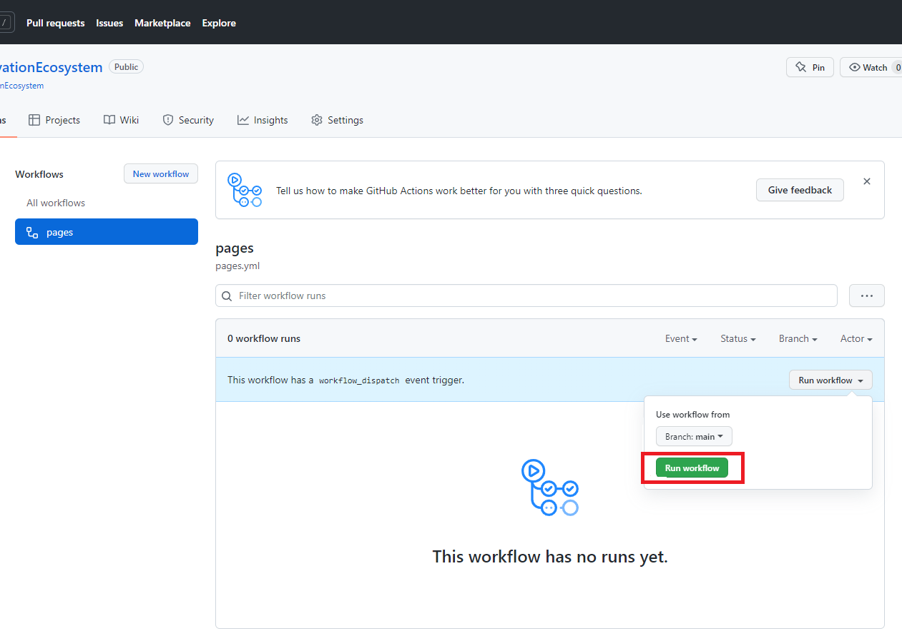
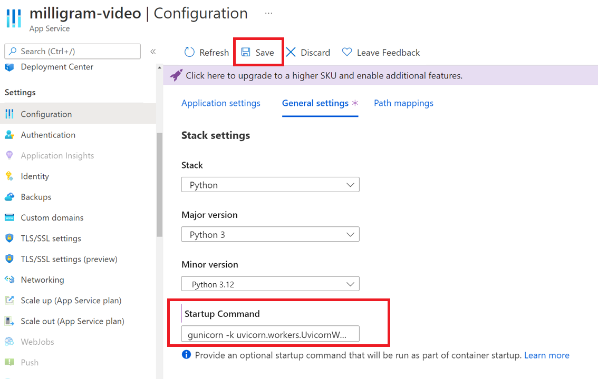
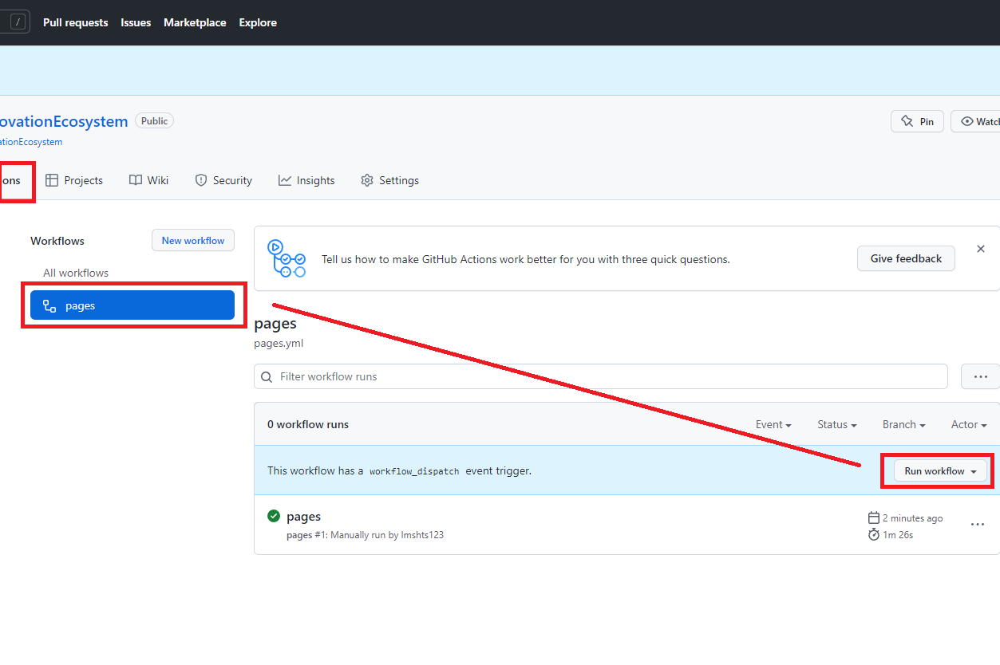

# 課題3：Azureでアプリケーションを動かしてみよう

⏲️ _完了までの時間: 60 min._ ⏲️

## このパートで学ぶこと 🎯

- GitHub Actionsを始めましょう
- MilligramアプリケーションのフロントエンドをGitHub Pagesで公開します
- AzureでPython Webアプリを作成します
- GitHub ActionsでAzureにMilligramアプリケーションのバックエンドをデプロイします

## 目次

- [課題3：Azureでアプリケーションを動かしてみよう](#課題3azureでアプリケーションを動かしてみよう)
  - [このパートで学ぶこと 🎯](#このパートで学ぶこと-)
  - [目次](#目次)
    - [参考になる情報](#参考になる情報)
  - [Milligramアプリケーションフロントエンド](#milligramアプリケーションフロントエンド)
    - [GitHub Actions を有効にします](#github-actions-を有効にします)
    - [GitHub Actionsを実行します](#github-actionsを実行します)
    - [プロジェクト設定でGitHub Pagesを有効にします](#プロジェクト設定でgithub-pagesを有効にします)
    - [スマートフォンでMilligramアプリケーションを開きます](#スマートフォンでmilligramアプリケーションを開きます)
    - [ホーム画面にアプリケーションを追加します](#ホーム画面にアプリケーションを追加します)
  - [Milligramアプリケーションバックエンド](#milligramアプリケーションバックエンド)
    - [Azureにログインします](#azureにログインします)
    - [Azure Storage Accountを作成します](#azure-storage-accountを作成します)
    - [Webアプリを作成します](#webアプリを作成します)
    - [ストレージとWebアプリを構成します](#ストレージとwebアプリを構成します)
    - [Azure Webアプリの構成](#azure-webアプリの構成)
    - [GitHubアクションを介してミリグラムバックエンドコードをAzure Webアプリにデプロイします](#githubアクションを介してミリグラムバックエンドコードをazure-webアプリにデプロイします)
    - [Milligramアプリが正しく実行されているかどうかを確認しよう](#milligramアプリが正しく実行されているかどうかを確認しよう)
    - [振り返り！私たちはこれまで何をしましたか？](#振り返り私たちはこれまで何をしましたか)
    - [GitHub SecretsにAzure WebアプリURLを連携します](#github-secretsにazure-webアプリurlを連携します)
    - [フロントエンドパイプラインをもう一度実行します](#フロントエンドパイプラインをもう一度実行します)
    - [Milligramアプリケーションを開く - セルフィーを取り、ニュースフィードを確認しましょう](#milligramアプリケーションを開く---セルフィーを取りニュースフィードを確認しましょう)

### 参考になる情報

- [GitHub Actionsとは?](https://github.com/features/actions)
- [GitHub Actions ドキュメント](https://docs.github.com/actions)
- [リポジトリとは?](https://docs.github.com/github/creating-cloning-and-archiving-repositories/creating-a-repository-on-github/about-repositories)
- [Resource / Resource Group / Subscription とは?](https://docs.microsoft.com/azure/cloud-adoption-framework/govern/resource-consistency/resource-access-management)

## Milligramアプリケーションフロントエンド

まず、フロントエンドアプリケーション(スマートフォンまたはWebブラウザーで表示される部分)から始めましょう。

フロントエンドとは？

シンプルな車を想像してみましょう。あなたが見えるものすべて - 座席、屋根、床、ユーザーインターフェイス（ダッシュボード、ステアリングホイールなど） - アプリケーションではそれらを**frontend** と呼びます。

次にボンネットを開きます。エンジン、トランスミッション、その他の要素を見ることができます。 アプリケーションではこれらが **backend** や **API** です。

つまり **frontend** は、ユーザーが**API** を介して**backend** に指示を提供するものです。それは、車のペタルを踏むと、エンジンが加速するのとよく似ています。

### GitHub Actions を有効にします

GitHubには、Webサイトを作成する機能(**GitHub Pages**) および更新を自動化する機能(**GitHub Actions**)があります。

- リポジトリの***Actions**に移動します

- **_I understand my workflows, go ahead and enable them_** と書かれたボタンをクリックして、先に進み、GitHubアクションを有効にします

_ [repository](https://docs.github.com/github/creating-cloning-and-archiving-repositories/creating-a-repository-on-github/about-repositories)にすべてのプロジェクトのファイルと各ファイルのファイルが含まれています。リポジトリ内でプロジェクトの作業について話し合い、管理できます。

ここで、**GitHub Actions** に読み取り/書き込み許可があることを確認してください。GitHubリポジトリの **[Settings]** -> **[Actions]** -> **[General]** をクリックし、**_WorkFlow Permissions_** セクションまでスクロールします。 **_read and write permissions_** オプションをクリックして、**_save_** をクリックします。

### GitHub Actionsを実行します

- リポジトリの **Actions** タブで、**pages** ワークフローをクリックします。
- [**Run Workflow**] ドロップダウンを開き、[**Run Workflow**]ボタンをクリックして、ワークフローの実行を確認します。

次に、ワークフローがどのように実行されているかを観察し、GitHubが実行する流れを見てみましょう。

### プロジェクト設定でGitHub Pagesを有効にします

GitHub Actionsを使用して構築および展開したWebサイト( **frontend** ) を表示できるようにするには、リポジトリに対してGitHub Pagesを有効にする必要があります。GitHub Pages は、リポジトリに関連する静的Webサイトを簡単に表示する機能です。

多くの人がそれを使用して、プロジェクトのドキュメントを表示します。Milligramアプリケーションのフロントエンドを提供するために使用します。

- **repository settings** に移動します 
  
-  **Pages** に移動し、ブランチ `gh-pages` を選択し、**[Save]** ボタンをクリックします。
  
- デプロイには1〜2分かかります。その後、Milligramアプリケーションは次のURLで確認できます。
  `https://<ご自身のGitHubアカウント名>.github.io/everyonecancode/`.

ウェブサイトを確認します。プロファイルをご自身のGitHubアカウント名に変更してみて、プロフィール写真が変更されていることを確認してください。

### スマートフォンでMilligramアプリケーションを開きます

Milligramアプリケーションは、あなたがよく知っているかもしれない写真ベースのソーシャルメディアに似た楽しいアプリです。もちろん、スマートフォンでカメラを使用して写真を撮って投稿できます。

その主な機能は次のとおりです。

- あなた自身のプロフィールからGitHubアカウント情報を表示する
- 写真を撮って画像を表示する
- 写真の画像内のオブジェクトを検出し、画像の説明を作成します
-  Azure Speech Serviceを使用してマイクで話した内容を文字に起こします

今アプリは利用可能です。しかし、まだストレージやデータベースはありません。そのため、データを保存できません。そこで次のステップでこれらをインストールします。

さて、最初の変更を行うには、スマートフォンでMilligramアプリケーションを開き、コンテンツを探索します。次に、アプリのプロファイルを編集して、アプリに独自のGitHubプロファイル写真を表示します。

### ホーム画面にアプリケーションを追加します

最新のスマートフォンでは、ホーム画面にWebアプリを「インストール」して、よりアクセスしやすくし、公式アプリのように見せることができます。したがって、アプリをスマートフォンのホーム画面に追加することはありません。

- ブラウザメニューを開いて、ホーム画面にWebサイトを追加します。
 - iOSの場合:
    
 - Androidの場合:
    

これで、スマートフォンのホーム画面から通常のアプリのようにウェブサイトを開くことができます。

## Milligramアプリケーションバックエンド

アプリケーションバックエンドは、アップロードされた写真を受け取り、それらを保存し、必要に応じて返します。

アプリケーションは、フロントエンド（スマートフォンで表示されるもの）とバックエンド（情報を処理するもの）に分割できます。この場合、独自のソーシャルメディアアプリケーションを作成したいため、「ニュースフィード」のために写真を保存する必要があります。つまり、多くのファイルを保存する場所と、アプリケーションロジック（プログラミングコード）を実行する場所が必要です。

ファイルを保存するには、**「Azure Storage Account」** を使用し、アプリケーションロジックを実行するには、 **「Azure Web App」** を使用します。

まず最初に -**「Azure Storage Account」** にサインします。

### Azureにログインします

- ブラウザで[portal.azure.com](hhttps://ms.portal.azure.com/?l=en.en-us#home)にアクセスしてください。

- **「Azureアカウント」** でログインします。ログイン情報は、コーチから提供されます。わからない場合は遠慮なく質問してください。

### Azure Storage Accountを作成します

Azure Storage Accountは、ニュースフィードの写真を「保存」する場所です。

ストレージアカウント内では、[Azure Blob Storage](https://learn.microsoft.com/en-us/azure/storage/blobs/)を使用します。Azure Blob Storageには、膨大な量のファイルを保持できます。

Azure Blob Storageには好きなだけ多くの写真を保存でき、ストレージスペースを心配する必要がありません。

> **Azure Resource**: Azureの世界では、「リソース」はAzureが管理するエンティティを指します。たとえば、仮想マシン、仮想ネットワーク、およびストレージアカウントはすべてAzureリソースと呼ばれます。

> ***Azure Resource Group**: リソースグループは、Azureソリューションに関連するリソースを保持するコンテナです。リソースグループには、ソリューション用のすべてのリソース、またはグループとして管理したいリソースのみを含めることができます。

- Azureポータルのホームページに移動します。
- **_+ Create a resource_** をクリックしてリソースを作成します。
- **_Storage Account_** を検索し、**[_Create_]** ボタンをクリックします。
- Azureポータルにログインするために使用した名前で、サブスクリプションとリソースグループを選択します。
- Azureストレージアカウントの名前はグローバルで一意である必要があります。また、小文字と特殊文字は使用できません。
-  **「`Locally-redundant storage (LRS)`」** と **「`Standard`」** を選択してください。
  
-  **[_review_]** をクリックし、その後 **[_create_]** をクリックしてストレージアカウントを作成します。
- ストレージアカウントが作成されたら、**[_Go to resource_]** ボタンをクリックして、リソースに移動します。
- これで、ストレージアカウントが表示されます。次に画像を入れるためのコンテナを作ります。左側の **[_Containers_]** を選択します。
-  **[_new container_]** ボタンをクリックして、「`images`」という名前のコンテナを作成します。その他はデフォルトのままで問題ありません。

ここで作成した`images` というコンテナは、Milligramアプリケーションからアップロードされた画像が保存される場所です。

### Webアプリを作成します

[Azure Web App](https://learn.microsoft.com/en-us/azure/static-web-apps/)は、Microsoftが管理するコンピューターで、ソフトウェアの更新を心配することなく簡単に独自のWebアプリケーションを実行できる便利なサービスです。

- Azureポータルのホームページにもう一度移動します。
- **[_+ Create a resource_ ]** をクリックして、以前と同じようにリソースを作成します。
- **_Web App_** を検索し、**[_Create_]** をクリックします。
- サブスクリプションとリソースグループを選択します。
 - 以下の画像のとおり設定してください。
  
    - Name: `everyonecancode-backend-あなたの名前`
    - Publish: `Code`
    - Runtime stack: `Python 3.12`
    - Operating System: `Linux`
    - Region: `West Europe`
    

  - 新しい **App Service Plan** を作成します。名前は `everyonecancode-plan-あなたの名前` などとします。
  
- 価格のドロップダウンメニューで、無料の **Free F1** を選択します。そうしないと、料金が請求される場合があります。
- 画面の下部にある **_review + create_** をクリックします。
- 表示されている情報を確認し、次の画面で **_create_** をクリックしてバックエンドアプリケーションを作成します。

:::tip
📝 確認ページでは、サービスの推定コストに関する情報があります。`Estimated price` を確認してください
:::

### ストレージとWebアプリを構成します

それでは、アプリケーションをストレージに接続して、スマートフォンで写真を撮って保管できるようにしましょう。
ます、ストレージサービスの場所をWebアプリケーションに伝える必要があります。
アプリケーションは、ストレージアカウントへの接続を構成するために外部構成を取得できます。

- まずストレージサービスの場所とキー情報を確認します。ストレージアカウントを検索することで作成したリソースを表示します。
 -  ストレージにアクセスするためのキーは **_Access Keys_** 接続文字列は **_Connection String_** で確認できます。値を見るときは **_👀ShowKeys_** ボタンをおすと、その値をクリップボードにコピーできます。
  
 -  次に、Webアプリに戻って **[_Environment variables_]** タブを開き、 **[_New connection string_]** をクリックして、次のとおり新しい接続文字列を作成します。
   
  | Connection string | Type | Value |
  |-|-|-|
  | `STORAGE` | Custom | `コピーした接続文字列` |

- **`ok`** と **`Save`** をクリックします。
- 次に、左側メニューにある **_CORS_** タブまでスクロールし、 `https://<ご自身のGitHubアカウント名>.github.io` を**_Allowed Origins_** に入力します。
- ふたたび **`Save`** をクリックして設定完了です

これで、ストレージアカウントとWebアプリが正常に接続され、相互に通信できるようになりました。

### Azure Webアプリの構成

私たちのアプリは、既製のモジュールを使用して、ユーザーがコンテンツと対話できるようにします。

ただし、このモジュールはまだインストールされていません。インストールするために、アプリの起動時に実行される構成をWebアプリに提供し、ユーザーがアプリのデータと対話できるようにします。

-  **_settings_** の下の **_Configuration_** に移動します。
- タブの下にある **_General settings_** を確認します。バックエンドでは、プログラミング言語はPython、より具体的にはPython 3.12で作業しています。
- **_Startup Command_** に「`gunicorn -k uvicorn.workers.UvicornWorker`」を入力して **_save_** を押します。
  

### GitHubアクションを介してミリグラムバックエンドコードをAzure Webアプリにデプロイします

ソーシャルメディアアプリケーションが実際に何かを実行できるようにするには、ソースコードをAzure Webアプリに持ち込む必要があります。

そのために、この「デプロイ」と呼ばれる作業をGitHub Actionsで自動します。アプリケーションに変更を加える(たとえば、アプリケーションのタイトルを変更するなど)するたびに手動でなにかをする必要はありません。

- AzureポータルのWebアプリの左側にある **_Deployment Center_** タブに移動します。
-  **_settings_** タブの下で **_source_** として **_github_** を選択し、**_authorize_** をクリックします。
-  **_organization_** でGitHubのアカウント名を選択し、**_repository_** で「`anyonecancode`」と「`main`」ブランチを選択します。
- **`Save`** ボタンをクリックします。

**`Save`** ボタンを押すと、サービスはGitHubリポジトリにワークフローファイルを自動的に作成します。

このワークフローはすぐに実行され、約2分後にWebアプリの準備が整います。

リポジトリの **[Actions]** タブでを確認す​​ることもできます。緑色は問題なく進んでいることを表しています。

### Milligramアプリが正しく実行されているかどうかを確認しよう

問題なくデプロイできていることを確認するには、アプリのフロントエンドがバックエンドサービスから応答を取得するかどうかをテストします。

すべてをまとめる前に、バックエンドサービスが期待どおりに機能していることを確認したいと考えています。

- Azure ポータルからWebアプリサービスの左側の **_Overview_** タブに移動します。
  

 - **Default Domain** のURLの後ろに「/docs」を追加し、インタラクティブなドキュメントを使用してWebサイトをテストして、MilligramアプリケーションのAPIが動作するかどうかを確認します。

 URL: `http://everyonecancode-backend-xxxxx.azurewebsites.net/docs`

 - ブラウザでは、次のように見えるはずです。
  

  :::tip
  📝 もし OpenAPI について知りたいときは [Wikipedia](<https://en.wikipedia.org/wiki/OpenAPI_(software)>)を参考にしてください。
  :::

 -  **_GET/images_** エンドポイントを選択し、**「`Try it Out`」** をクリックして **`Execute`** を押します。200番の応答コードが返ってくると、正しく動いていることが確認できます。おめでとうございます！

  :::tip
  📝 [Wikipedia](https://en.wikipedia.org/wiki/List_of_HTTP_status_codes)のHTTP応答コードを見てください。2xxコードは一般に成功を意味し、4xxおよび5xxコードはさまざまな種類のエラーを示します。あなたはおそらく404をみたことがあるでしょう。これは「ページが見つかりません」という意味になります。
  :::

### 振り返り！私たちはこれまで何をしましたか？

おめでとうございます、あなたはあなたのWebアプリケーションにバックエンドを展開しました！これまでに行ったことを要約しましょう。

まず、GitHubページを使用してWebアプリのFrontend（ユーザーインターフェイス）を展開しました。これは、GitHub Pagesに行くときに表示されるものです。フロントエンドは、画像を提供してロジックを実行するためにサーバーを必要としていました。これがAzure部品が入った場所です。最初に、ストレージリソースを作成しました。これは画像を保存する責任があります。次に、Webアプリリソースを作成しました。ここでは、サーバーロジックを実行します。サーバーロジックは、FastAPIと呼ばれるフレームワークを使用してPythonで記述されています。サーバーロジックコードは、EveryOneCancode GitHubリポジトリでホストされています。WebアプリをGitHubリポジトリに接続し、Webアプリを起動すると特定のコマンドを実行するようにサーバーに指示しました。このコマンドはサーバーロジックの実行を開始します。これが、「/docs」の下でブラウザ内のドキュメントを見ることができる理由です。次に、フロントエンドをバックエンドに接続しましょう。

### GitHub SecretsにAzure WebアプリURLを連携します

これでバックエンドサービスが期待どおりに機能することを確認できたので、すべてをまとめることができます。

ここで、**_Secrets_** というGitHubの機能を使用します。ここでは、バックエンドURLを保存してフロントエンドをバックエンドサービスに通知することができます。

- GitHubのリポジトリページで **_settings_** を選択し、**_secrets and variables_** -> **_actions_** に移動します。
 -  **_New repository secret_** で **`VITE_IMAGE_API_URL`** と`ご自身のバックエンドのURL `をセットします。
 >⚠️⚠️ あなたのURLは `https：// xxxx.azurewabsites.net/`となっているはずです。かならず最後に`/` を入れるのを忘れないようにしましょう>
  
  

### フロントエンドパイプラインをもう一度実行します

フロントエンドで登録したシークレットを追加するには、プロセスが新しく作成された設定をピックアップできるように、ビルドパイプラインを再度実行する必要があります。

 - **_Actions_** タブに移動し、**_pages_** ワークフローを選択して、ワークフローを再実行します。
  

- ワークフローの実行をクリックして、以下のビューにアクセスできます。
  
  
- 最後にMilligram サービスが終了します。
  

### Milligramアプリケーションを開く - セルフィーを取り、ニュースフィードを確認しましょう

パイプラインの下にデプロイステップの下に表示されるフロントエンドのURLリンクをクリックします `https：// <yourgithubhandle> .github.io/...`またはスマートフォンでアプリを更新します。

フロントエンドアプリケーションには、写真を撮ることができるカメラボタンが表示されます。撮った写真は、タイムラインまたはニュースフィードに表示されるのを確認しましょう。

少なくとも5枚の写真を撮って、それらがあなたのアプリに表示されることを確認してください。彼らがあなたのニュースフィードに写真をアップロードできるように、チーム内のメンバーと共有するようにしてください。

おめてとうございます 🎉

次は私たちはあなたの画像内に何が移っているのかをAIを使って識別したり、マイクを使ってアプリと話すことができるような機能を追加していきます。

※ もしうまく動かなかったチームは サンプルのアプリケーション[Milligram](https://codeunicornmartha.github.io/FemaleAIAppInnovationEcosystem/#/?stack-key=a78e2b9a)で動作を見てください。

[◀ Previous challenge](../ApplicationPart1/README.md) | [🔼 Home](../../../README.md) | [Next challenge ▶](../../day2/Vision/README.md)
